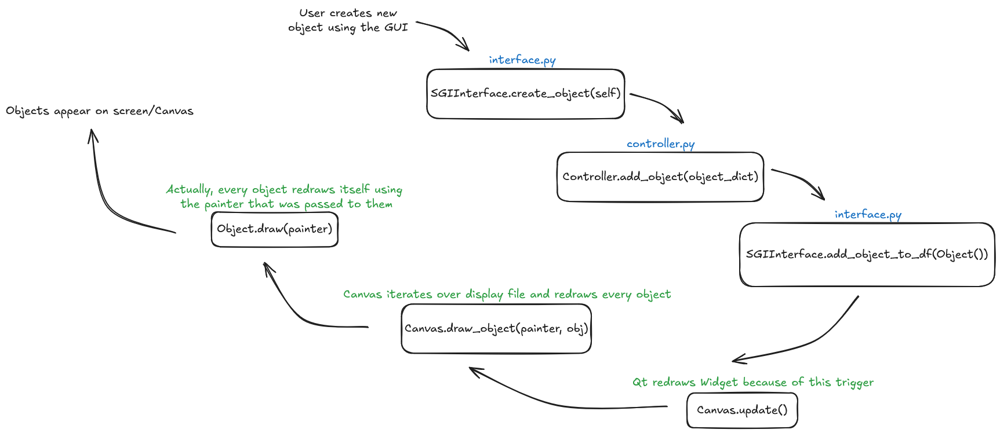

# Interactive Graphic System

Sistem Gráfico Interativo para Computação Gráfica baseado em `Python` e `PyQt`.

## Componentes

Os principais componentes do sistema são: `Viewport`, `Window` e `Display File`.

## Objetos

O sistema permite a criação de uma grande variedade de objetos gráficos, incluindo: Pontos, Linhas e Polígonos.

## Execução

*Obs: os passos a seguir consideram a utilização de um sistema operacional baseado em `Linux`.*

Para executar o programa é recomendado o uso de um ambiente virtual para isolar as dependências necessárias para sua execução do resto do sistema do usuário. Para isso, execute o seguinte comando:

```bash
python3 -m venv {venv_name}
```

Sendo `venv_name` o nome do ambiente virtual de sua escolha. Para ativá-lo e desativá-lo, respectivamente:

```bash
source venv/bin/activate

deactivate
```

Com o ambiente virtual criado e ativado, agora é preciso instalar os pacotes e bibliotecas que o programa utiliza para funcionar normalmente. Para isso, execute o seguinte comando:

```bash
pip install -r requirements.txt
```

Por fim, com os pacotes instalados, basta executar o arquivo principal presente na pasta `src/`:

```bash
python3 main.py
```

## Fluxos

### Criação de Novos Objetos



## Autores

Rita Louro Barbosa e Yano H. de Melo R. Cavalcante.

INE5420 - Computação Gráfica, Prof. Dr. rer.nat. Aldo von Wangenheim.
